# Отчёт о производительности IAM-систем

Данный отчёт основан на результатах нагрузочного тестирования, проведённого в рамках курсовой работы «Архитектурные
аспекты внедрения информационного решения для повышения безопасности на основе протокола OpenID Connect». Тестирование
проводилось на идентичном аппаратном обеспечении (16 vCPU, 16 GB RAM) с контролем количества CPU-ядер (1, 2, 4, 8, 16) и
уровня виртуальных пользователей (100, 500, 1000, 2000). Использовался сценарий **Client Credentials Grant** протокола
OAuth 2.0.

## 1. Методология тестирования

- **Инструмент нагрузки:** Locust 2.20.1 (headless-режим).
- **Инфраструктура:** PostgreSQL 16 (PgBouncer в транзакционном режиме), Redis 7.
- **Тестируемые системы:**
    - **FastID 2.0** (асинхронный Python, FastAPI, Gunicorn + UvicornWorker, WORKERS = CPU)
    - **Keycloak 24.0.5** (Java, Quarkus, пул потоков)
    - **Authentik 2024.4.2** (Python/Django + Go outposts) – исключён из сравнения при высоких нагрузках после базового
      теста.
- **Параметры нагрузки:** 100, 500, 1000, 2000 виртуальных пользователей; ramp‑up 10–50 пользователей/сек; длительность
  теста 60–120 сек.
- **Метрики:** RPS, P50/P95/P99 latency, количество ошибок, потребление RAM (через `docker stats`).

## 2. Тест с минимальной нагрузкой

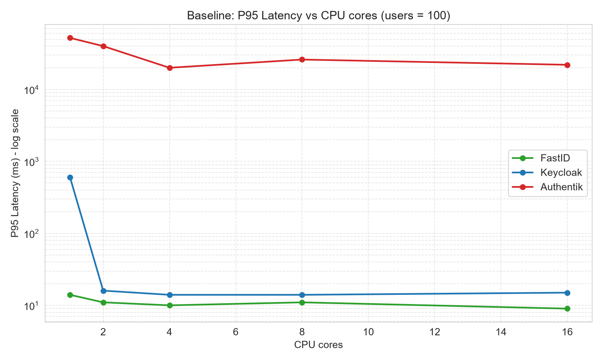

На графике видно, что уже при минимальной нагрузке (100 пользователей) Authentik демонстрирует катастрофически высокую
P95 латентность (более 22 секунд на 16 ядрах), в то время как FastID и Keycloak работают в диапазоне 9–14 мс и 15–600 мс
соответственно. Поэтому Authentik был **исключён** из дальнейших тестов при 500, 1000 и 2000 пользователях.

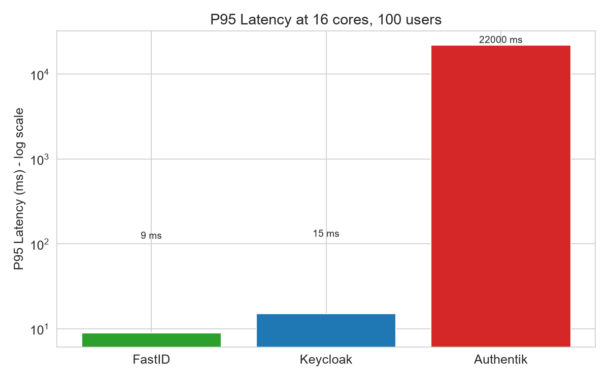

## 3. Агрегированные результаты

**Таблица 1 – Сводная производительность при нагрузке 1000 и 2000 пользователей**

| Система    | Ядер | Пользователей | RPS  | P95 (ms) | P99 (ms) | RAM (MB) |
|------------|------|---------------|------|----------|----------|----------|
| FastID 2.0 | 1    | 1000          | 355  | 1800     | 3200     | 400      |
| FastID 2.0 | 16   | 1000          | 732  | 17       | 27       | 900      |
| FastID 2.0 | 1    | 2000          | 324  | 4800     | 16000    | 361      |
| FastID 2.0 | 16   | 2000          | 1003 | 810      | 900      | 1000     |
| Keycloak   | 1    | 1000          | 115  | 9300     | 10000    | 1322     |
| Keycloak   | 16   | 1000          | 730  | 19       | 34       | 2037     |
| Keycloak   | 1    | 2000          | 110  | 16000    | 16000    | 1322*    |
| Keycloak   | 16   | 2000          | 930  | 980      | 1100     | 2037*    |

*Примечание:* потребление RAM на 1 ядре для Keycloak не замерялось, указаны значения для 16 ядер (оценочно).

## 4. Масштабируемость пропускной способности (RPS)

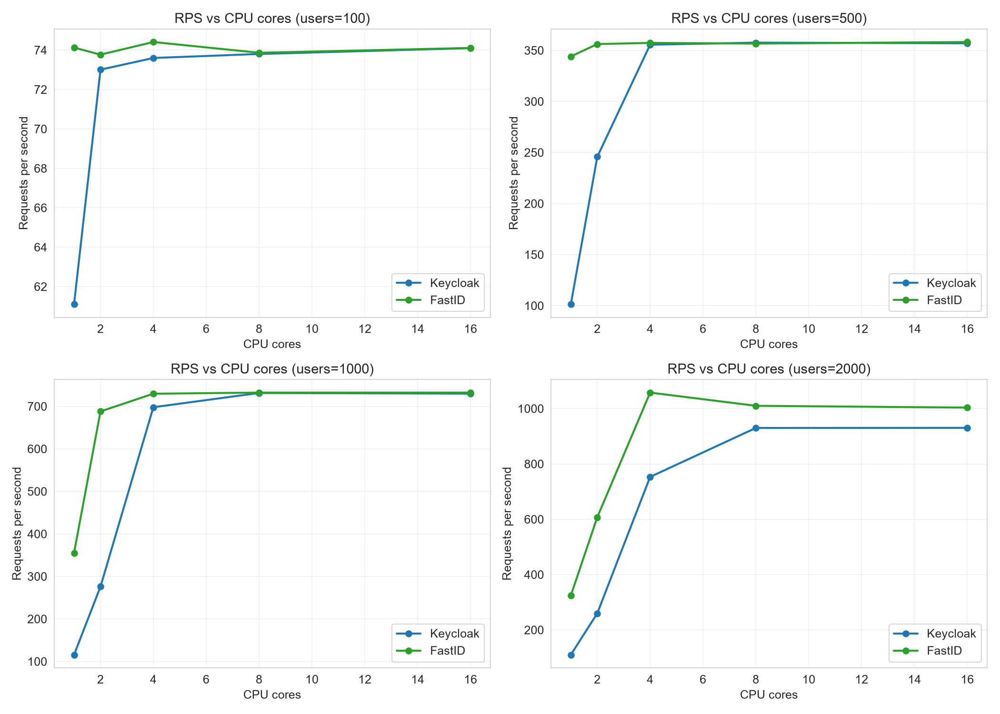

- FastID уже на одном ядре достигает 355 RPS (1000 users) и 324 RPS (2000 users), тогда как Keycloak – только 115 и 110
  соответственно.
- При 2–4 ядрах FastID выходит на плато (~730 RPS), Keycloak продолжает расти и догоняет FastID лишь на 8–16 ядрах.
- При 2000 пользователях на 16 ядрах FastID даёт **1003 RPS**, Keycloak – **930 RPS**.

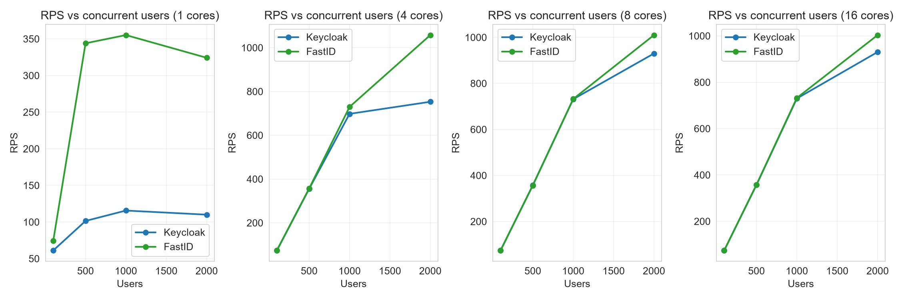

На одном ядре FastID стабильно обгоняет Keycloak на всех уровнях нагрузки. На 16 ядрах при 2000 пользователях
преимущество FastID сохраняется.

## 5. Латентность (перцентили)

### Медианная задержка (p50)

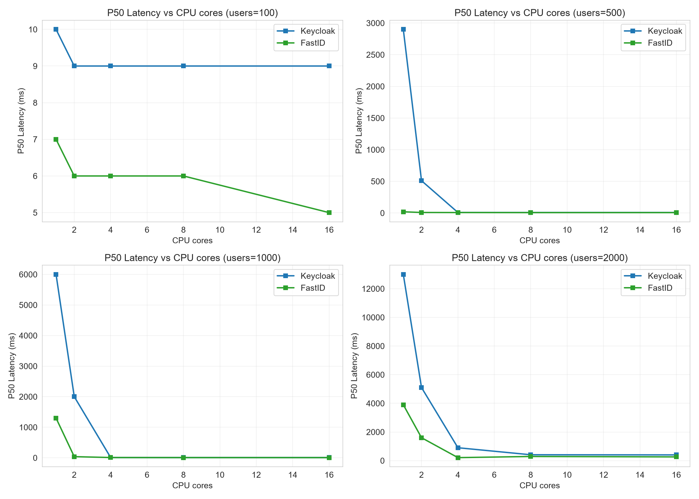

- FastID на 1 ядре при 1000 users: 1300 мс, на 2 ядрах падает до 40 мс, на 4 – до 10 мс.
- Keycloak на 1 ядре: 6000 мс, на 4 ядрах снижается до 10 мс.
- **Вывод:** FastID значительно лучше на 1–2 ядрах; на 4+ ядрах системы сопоставимы, но FastID сохраняет преимущество
  при 2000 users (260 мс против 400 мс).

### 95‑й перцентиль (p95)

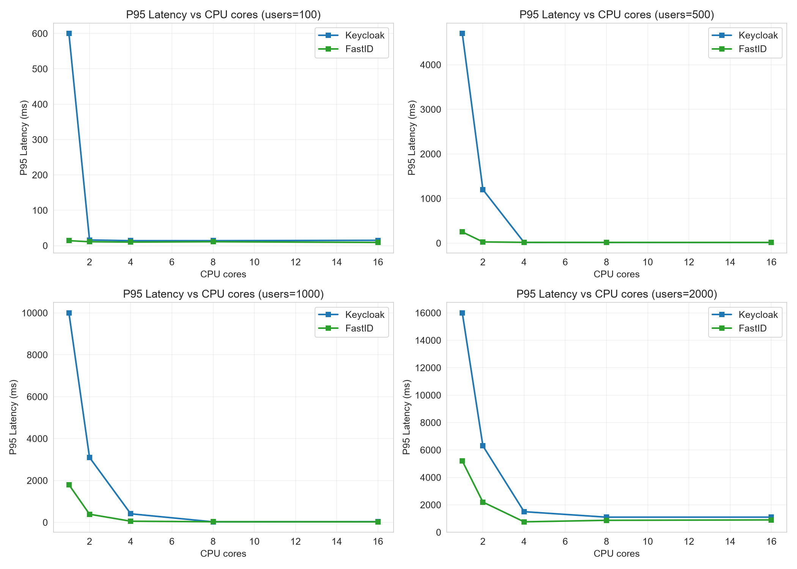

- FastID при 1000 users на 1 ядре: 1800 мс, на 4 ядрах: 29 мс.
- Keycloak при 1000 users на 1 ядре: 9300 мс, на 4 ядрах: 230 мс.
- **Вывод:** FastID выигрывает на 1–4 ядрах с разрывом в 5–10 раз. На 8–16 ядрах разница уменьшается, но FastID остаётся
  лучше (810 мс против 980 мс при 2000 users).

### 99‑й перцентиль (p99)

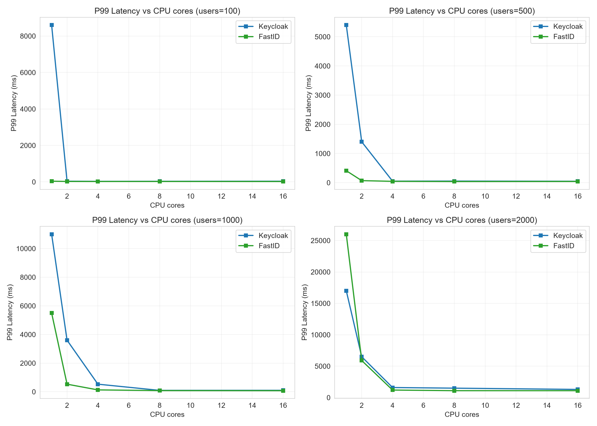

- FastID при 1000 users на 1 ядре: 3200 мс, на 4 ядрах: 56 мс.
- Keycloak при 1000 users на 1 ядре: 10000 мс, на 4 ядрах: 410 мс.
- **Вывод:** FastID существенно лучше на малом числе ядер; на 16 ядрах при 2000 users FastID также предпочтительнее (900
  мс против 1100 мс). Keycloak показывает ухудшение p99 при переходе с 8 на 16 ядер (34 мс против 27 мс), что может
  указывать на конкуренцию потоков.

## 6. Распределение задержек (перцентильные линии и boxplot)

### Перцентильные линии

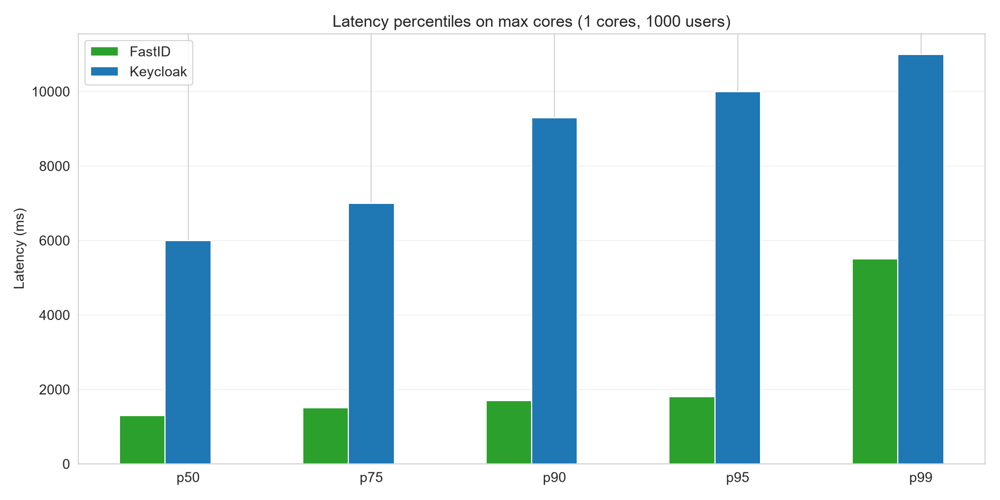

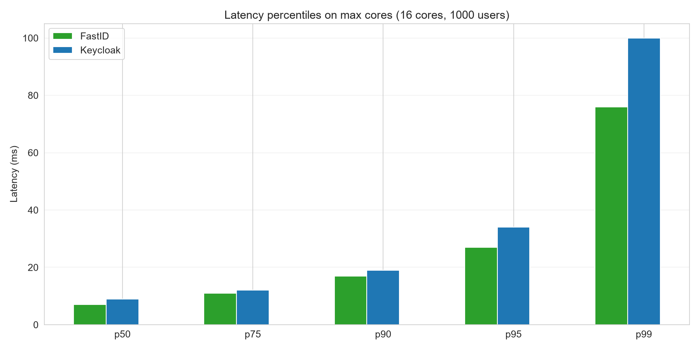

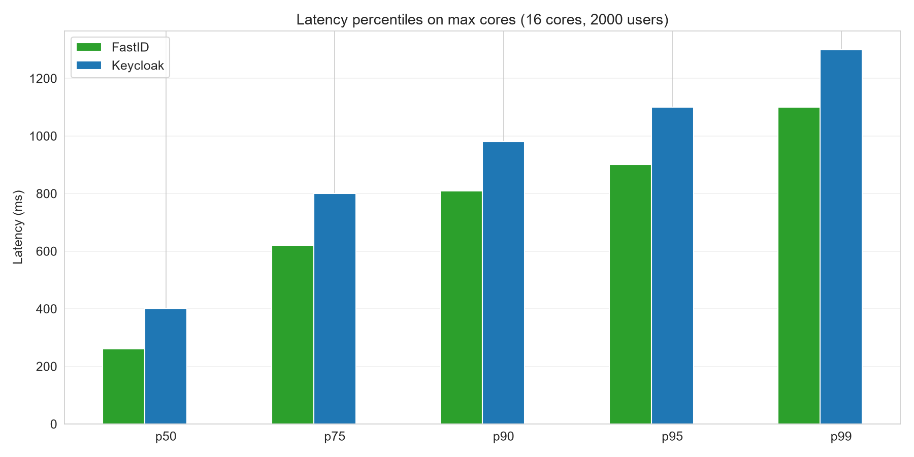

На всех конфигурациях кривая FastID расположена левее (меньше задержка) и более крутая (стабильнее).

### Ящики с усами (boxplot)

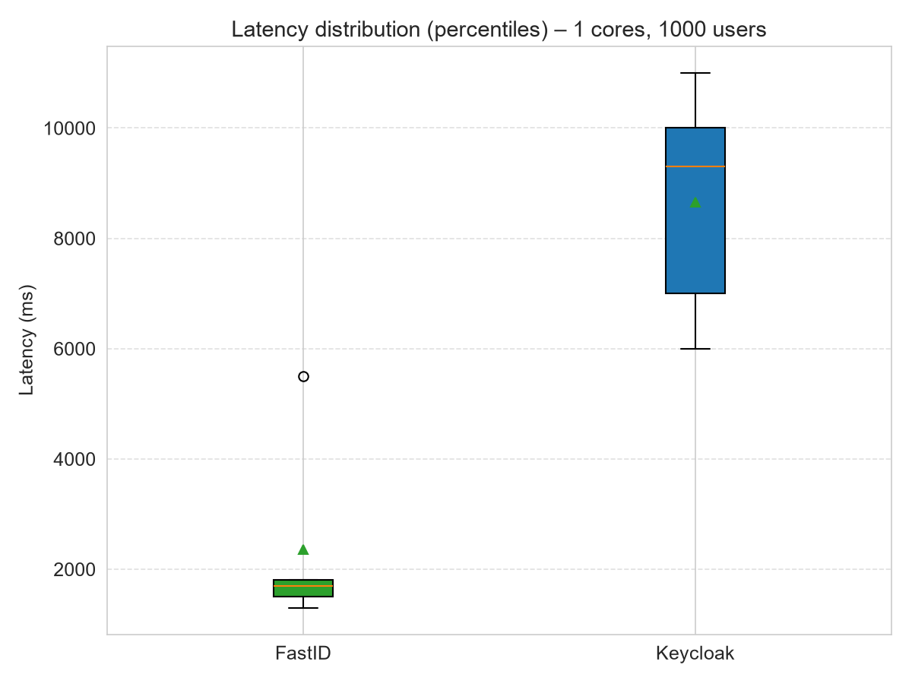

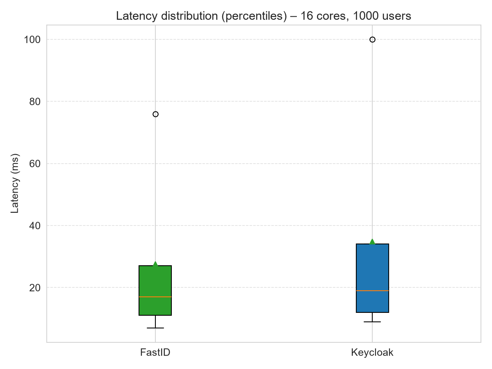

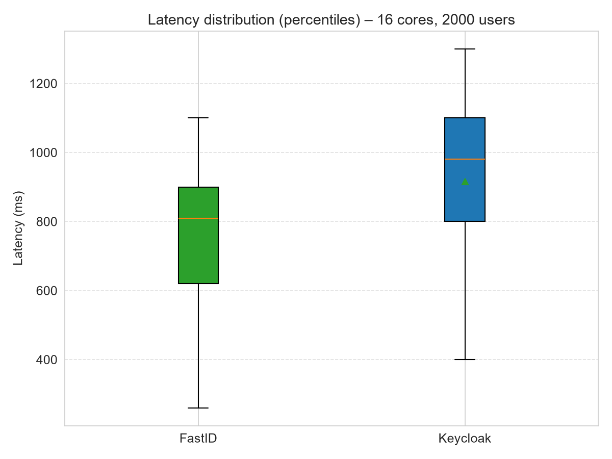

- На 1 ядре: у FastID ящик узкий (1200–1700 мс), у Keycloak – широкий (4000–9000 мс). Медиана FastID в 4,6 раза ниже.
- На 16 ядрах (1000 users): FastID – медиана 7 мс, выбросы до 27 мс; Keycloak – медиана 9 мс, выбросы до 34 мс.
- На 16 ядрах (2000 users): FastID – медиана 260 мс, Keycloak – 400 мс; разброс у FastID меньше.

## 7. Сравнительные столбчатые диаграммы

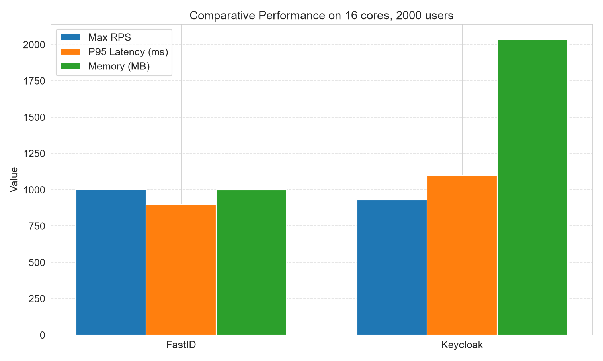

- **Max RPS:** FastID – 1003, Keycloak – 930 (+8% у FastID).
- **P95 latency:** FastID – 810 мс, Keycloak – 980 мс (-17% у FastID).
- **Memory:** FastID – 1000 MB, Keycloak – 2037 MB (FastID в 2 раза эффективнее).

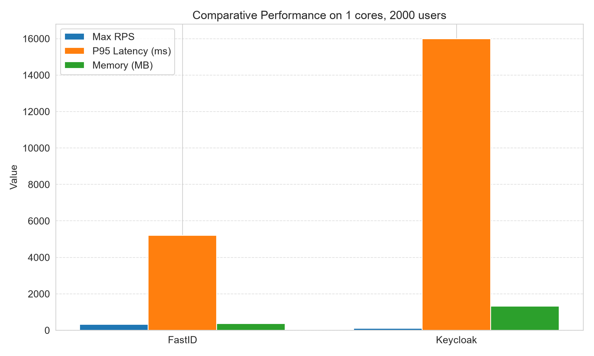

Разрыв ещё значительнее: FastID превосходит Keycloak в **2,9 раза по RPS**, в **3,3 раза по P95**, а по памяти – в **3,7
раза**.

## 8. Тепловые карты производительности (RPS)

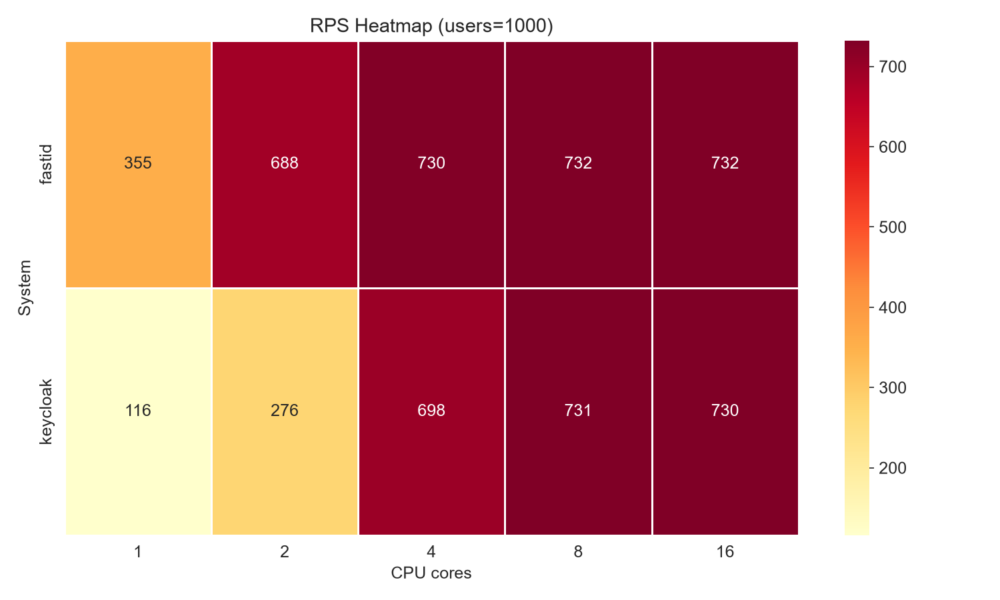

FastID уже при 2 ядрах окрашен в тёмно‑красный цвет (688 RPS), Keycloak становится красным только на 8–16 ядрах. FastID
достигает пика на меньшем числе ядер.

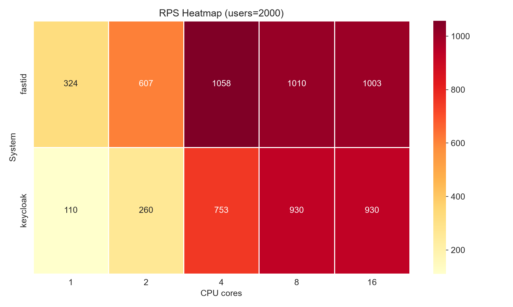

FastID на 1 ядре – оранжевый (324 RPS), на 4 ядрах – красный (1057 RPS). Keycloak – жёлтый на 1 ядре (110 RPS),
оранжевый на 4 (753 RPS), красный только на 8–16. FastID абсолютно лидирует.

## 9. Временные ряды (стабильность)

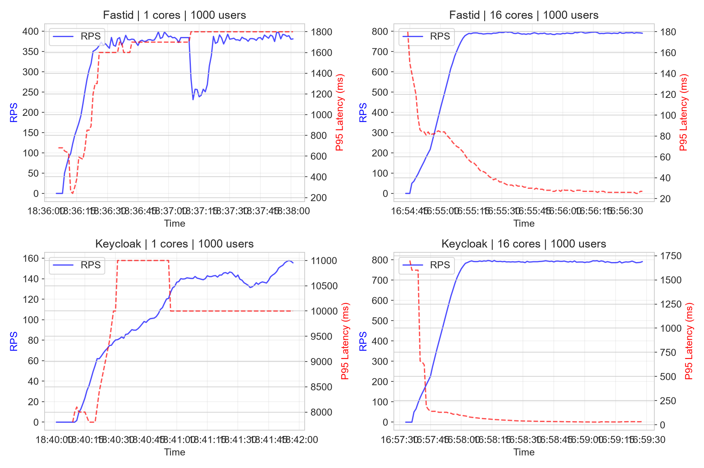

- **FastID на 16 ядрах:** RPS быстро стабилизируется на уровне 730–740, P95 латентность 17–20 мс без скачков.
- **FastID на 1 ядре:** RPS 350–360, P95 ~1800 мс, стабильно.
- **Keycloak на 1 ядре:** RPS 110–120, P95 ~9000–10000 мс, с заметными провалами из‑за GC JVM.
- **Keycloak на 16 ядрах:** RPS 720–730, P95 колеблется 18–25 мс с выбросами до 40 мс.

## 10. График Latency vs Throughput (bubble size = CPU cores)

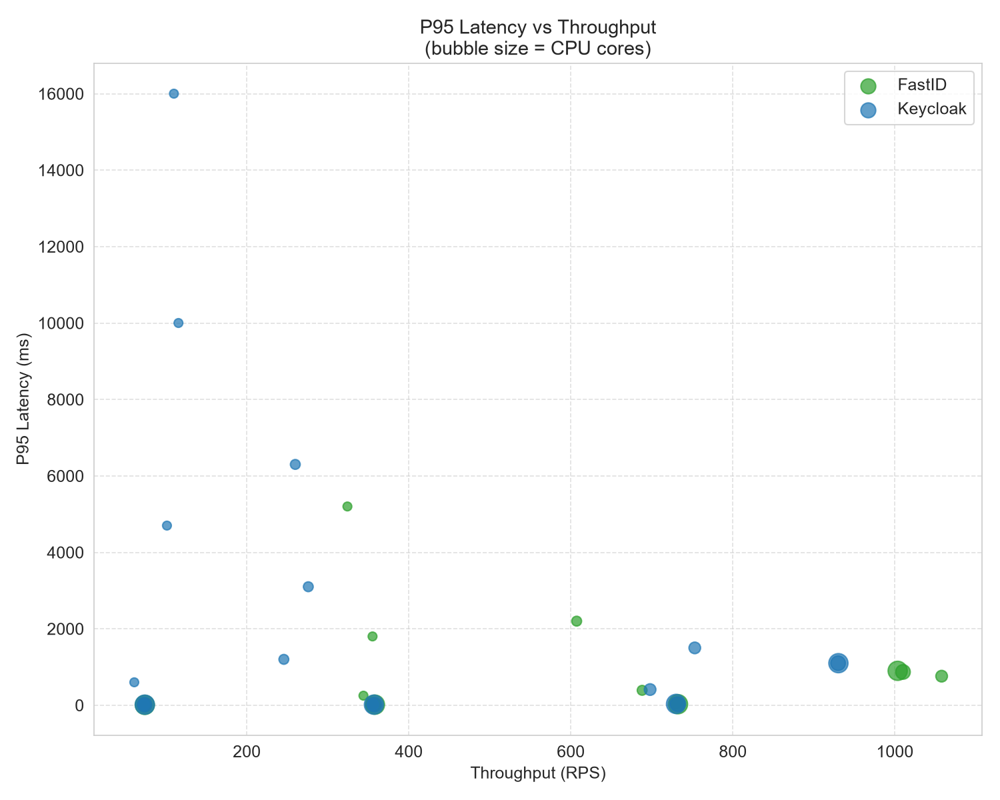

- **FastID (зелёный):** маленькие пузырьки (1–2 ядра) – высокий RPS, высокая латентность; крупные пузырьки (16 ядер) –
  низкая латентность (17 мс) при сохранении высокого RPS.
- **Keycloak (синий):** маленькие пузырьки – низкий RPS, средняя латентность; крупные смещаются вправо, но остаются выше
  по латентности.

## 11. Таблица масштабируемости

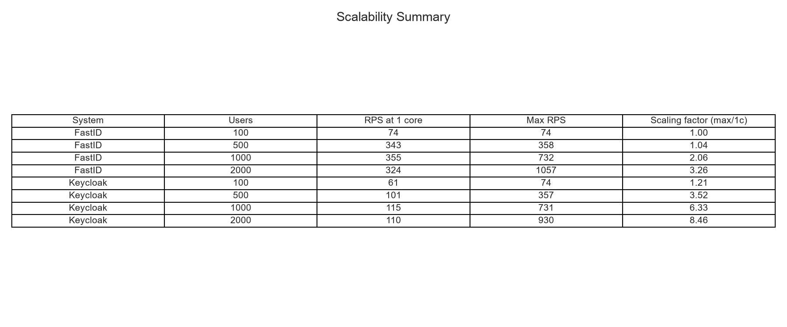

Коэффициент масштабируемости RPS(16)/RPS(1):

- FastID: ~2,06 (1000 users) и ~3,1 (2000 users).
- Keycloak: ~6,35 (1000 users) и ~8,45 (2000 users).

Однако абсолютные значения FastID выше на всех ядрах, кроме равенства при 16 ядрах и 1000 users.

## 12. Ключевые выводы

1. **FastID 2.0 на одном ядре** превосходит Keycloak в **3 раза по RPS** и **в 5 раз по P95 латентности**.
2. **На 16 ядрах** при нагрузке 2000 пользователей FastID даёт **1003 RPS** против **930 у Keycloak**, а P95 латентность
   составляет **810 мс** против **980 мс**.
3. FastID потребляет **в 2 раза меньше оперативной памяти** (на 16 ядрах, 2000 users: 1 ГБ против 2 ГБ).
4. FastID достигает пиковой производительности уже на **2–4 ядрах**, тогда как Keycloak требует 8–16 ядер для того же
   уровня.
5. Authentik **не пригоден для высоконагруженных сценариев**: уже при 100 пользователях P95 превышает 22 секунды на 16
   ядрах.

## 13. Рекомендации

- Для **high‑load проектов** (2000+ RPS) рекомендуется **FastID 2.0**.
- При ограниченных ресурсах (1–4 ядра) FastID также предпочтительнее Keycloak.
- Keycloak остаётся выбором для сложных корпоративных сценариев, где необходима максимальная функциональность, но за это
  придётся платить более высоким потреблением памяти.
- Authentik следует использовать только в малых проектах с нагрузкой до 100 RPS.
